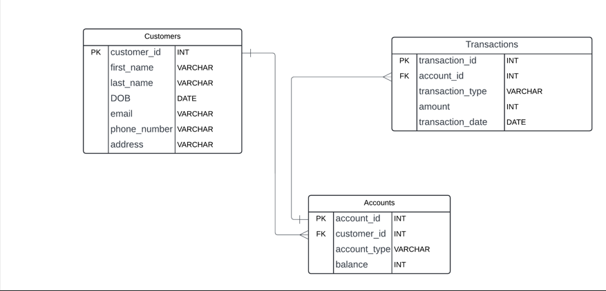

## Task 1


1. Create the database named "HMBank"
```sql
    create database HMBank
    USE HMBank;
```
2. Define the schema for the Customers, Accounts, and Transactions tables based on the 
provided schema.
4. Create an ERD (Entity Relationship Diagram) for the database.

5. Create appropriate Primary Key and Foreign Key constraints for referential integrity.
6. Write SQL scripts to create the mentioned tables with appropriate data types, constraints, 
and relationships. 
• Customers
• Accounts
• Transactions


```sql

    CREATE TABLE [Customers] (
    [customer_id] INT,
    [first_name] VARCHAR(255),
    [last_name] VARCHAR(255),
    [DOB] DATE,
    [email] VARCHAR(255),
    [phone_number] VARCHAR(255),
    [address] VARCHAR(255),
    PRIMARY KEY ([customer_id])
    );

    CREATE TABLE [Accounts] (
    [account_id] INT,
    [customer_id] INT,
    [account_type] VARCHAR(255),
    [balance] VARCHAR(255),
    PRIMARY KEY ([account_id]),
    Foreign Key ([customer_id]) References Customers([customer_id])
    );

    CREATE TABLE [Transactions] (
    [transaction_id] INT,
    [account_id] INT,
    [transaction_type] VARCHAR(255),
    [amount] VARCHAR(255),
    [transaction_date] DATE,
    PRIMARY KEY ([transaction_id]),
    Foreign Key ([account_id]) References Accounts([account_id])
    );
```
## Tasks 2: Select, Where, Between, AND, LIKE:
1. Insert at least 10 sample records into each of the following tables. 
• Customers
• Accounts
• Transactions
```sql
    INSERT INTO Customers (customer_id, first_name, last_name, DOB ,email ,phone_number ,address)
    VALUES  ('1', 'Tanishq', 'Lambhate','2002-08-15','tanulambhate@gmail.com','9644730922','Indore'),
            ('2', 'Ramesh', 'Sharma','2002-09-15','rameshsharma@gmail.com','9340421111','Bhopal'),
            ('3', 'Priya', 'Patel', '1995-03-20', 'priyapatel@gmail.com', '9876543210', 'Mumbai'),
            ('4', 'Sandeep', 'Singh', '1990-07-12', 'sandeepsingh@gmail.com', '8765432109', 'Delhi'),
            ('5', 'Ananya', 'Gupta', '1988-11-05', 'ananyagupta@gmail.com', '7654321098', 'Kolkata'),
            ('6', 'Rahul', 'Joshi', '1993-04-30', 'rahuljoshi@gmail.com', '6543210987', 'Chennai'),
            ('7', 'Kiran', 'Kumar', '1985-09-22', 'kirankumar@gmail.com', '5432109876', 'Hyderabad'),
            ('8', 'Swati', 'Sharma', '1982-12-10', 'swatisharma@gmail.com', '4321098765', 'Pune'),
            ('9', 'Vikram', 'Verma', '1979-06-15', 'vikramverma@gmail.com', '3210987654', 'Jaipur'),
            ('10', 'Neha', 'Thakur', '1976-01-25', 'nehathakur@gmail.com', '2109876543', 'Ahmedabad');

    Select * from Customers;

    -- Accounts
    INSERT INTO Accounts (account_id,customer_id, account_type, balance)
    VALUES ('101', '1', 'savings','100000'),
            ('102', '2', 'current', '50000'),
            ('103', '3', 'savings', '75000'),
            ('104', '4', 'current', '120000'),
            ('105', '5', 'savings', '25000'),
            ('106', '6', 'current', '80000'),
            ('107', '7', 'savings', '300000'),
            ('108', '8', 'current', '60000'),
            ('109', '9', 'savings', '200000'),
            ('110', '10', 'zero_balance', '90000');

    Select * from Accounts;
    -- Transactions
    INSERT INTO Transactions (transaction_id,account_id,transaction_type, amount, transaction_date)
    VALUES ('10101', '101', 'deposit','1000','2024-04-26'),
            ('10102', '102', 'withdrawal', '500', '2024-04-27'),
            ('10103', '103', 'deposit', '2000', '2024-04-27'),
            ('10104', '104', 'withdrawal', '1000', '2024-04-26'),
            ('10105', '105', 'transfer', '500', '2024-04-25'),
            ('10106', '106', 'deposit', '1500', '2024-04-25'),
            ('10107', '107', 'withdrawal', '2000', '2024-04-24'),
            ('10108', '108', 'transfer', '1000', '2024-04-23'),
            ('10109', '109', 'deposit', '3000', '2024-04-22'),
            ('10110', '110', 'withdrawal', '700', '2024-04-21'),
            ('10111', '101', 'deposit', '2500', '2024-04-20');
```
2. Write SQL queries for the following tasks:
  1. Write a SQL query to retrieve the name, account type and email of all customers. 
```sql
    Select first_name + last_name as name,email,account_type from customers inner join Accounts on customers.customer_id=accounts.customer_id;
```
2. Write a SQL query to list all transaction corresponding customer.
```sql
    Select * from Transactions inner join Accounts on transactions.account_id=Accounts.account_id inner join Customers on Accounts.customer_id=Customers.customer_id ;
```
3. Write a SQL query to increase the balance of a specific account by a certain amount.
```sql
    Update Accounts set balance=balance+200 where account_id=101;
```
4. Write a SQL query to Combine first and last names of customers as a full_name.
```sql
    Select first_name +' '+ last_name as full_name from Customers;
```
5. Write a SQL query to remove accounts with a balance of zero where the account 
type is savings.
```sql
        --Update Accounts set balance=0 where account_id=109;
		--Select * from Transactions;
		--Select account_id from Accounts where balance=0 AND account_type='savings';
		--Select * from Transactions where account_id=(Select account_id from Accounts where balance=0 AND account_type='savings');
		
		Delete from Transactions where account_id=(Select account_id from Accounts where balance=0 AND account_type='savings');
		Delete from Accounts where balance=0 AND account_type='savings';
```
6. Write a SQL query to Find customers living in a specific city.
```sql
    Select * from customers where address='pune' ;
```
7. Write a SQL query to Get the account balance for a specific account.
```sql
    select balance from Accounts where account_id=102;
```
8. Write a SQL query to List all current accounts with a balance greater than $1,000.
```sql
    select * from Accounts where account_type='current' AND balance>1000;
```
9. Write a SQL query to Retrieve all transactions for a specific account.
```sql
    Select * from transactions where account_id=108;
```

10. Write a SQL query to Calculate the interest accrued on savings accounts based on a 
given interest rate.
```sql
    Select (balance*15)/100 from Accounts where account_type='savings';
```
11. Write a SQL query to Identify accounts where the balance is less than a specified 
overdraft limit.
```sql
    Select * from Accounts where balance<100000;
```
12. Write a SQL query to Find customers not living in a specific city.
```sql
    Select * from Customers where address!='pune';
```
## Tasks 3: Aggregate functions, Having, Order By, GroupBy and Joins:
1. Write a SQL query to Find the average account balance for all customers. 
```sql
    select  AVG(balance),customer_id from Accounts group by customer_id;
```
2. Write a SQL query to Retrieve the top 10 highest account balances.
```sql
    select * from accounts order by balance desc offset 0 rows fetch next 10 rows only;
```
3. Write a SQL query to Calculate Total Deposits for All Customers in specific date.
```sql
    select  distinct(transaction_date),sum(amount)as total_deposits from transactions where transaction_type='deposit' group by transaction_date ;
```
4. Write a SQL query to Find the Oldest and Newest Customers.
```sql
    select max(DOB)as newest_customer,min(DOB)as oldest_customer from customers  ;
```
5. Write a SQL query to Retrieve transaction details along with the account type.
```sql
    select * from Transactions left join accounts on transactions.account_id=accounts.account_id; 
```
6. Write a SQL query to Get a list of customers along with their account details.
```sql
    select * from Customers inner join accounts on Customers.customer_id=accounts.customer_id; 
```
7. Write a SQL query to Retrieve transaction details along with customer information for a 
specific account.
```sql
    select * from Transactions left join accounts on transactions.account_id=accounts.account_id where accounts.account_id=102; 
```
8. Write a SQL query to Identify customers who have more than one account.
```sql
    select * from customers where customer_id in (select customer_id from accounts group by customer_id having count(customer_id)>1)
```
9. Write a SQL query to Calculate the difference in transaction amounts between deposits and 
withdrawals.
```sql
    select transactions.amount-transaction2.amount as difference_amount from  Transactions inner join transactions as transaction2 on  transactions.account_id=transaction2.account_id where transactions.transaction_type='withdrawal' and transaction2.transaction_type='deposit';
```
10. Write a SQL query to Calculate the average daily balance for each account over a specified 
period.
```sql
    select account_id, avg(balance) as average_daily_balance
from (select account_id, sum(balance) as balance
    from Accounts
    where date(transaction_date) between '2021-01-12' and '2021-01-14'
    group by account_id, date(transaction_date)
) as daily_balances
group by accounts account_id;
```
11. Calculate the total balance for each account type.
```sql
    select sum(balance)as total_balance,account_type  from accounts group by account_type
```
12. Identify accounts with the highest number of transactions order by descending order.
```sql
    select count(account_id),account_id from transactions group by account_id order by count(account_id) desc;
```
13. List customers with high aggregate account balances, along with their account types.
```sql
    select c.first_name,c.last_name,sum(a.balance) as aggregate_balance,a.account_type from Customers as c inner join Accounts as a on c.customer_id=a.customer_id 
		group by c.first_name,c.last_name,a.balance ,a.account_type
		order by a.balance desc;
```
14. Identify and list duplicate transactions based on transaction amount, date, and account.
```sql
    select transaction_id, account_id, transaction_type, amount, transaction_date
from Transactions
where (amount, transaction_date, account_id) in (
    select amount, transaction_date, account_id
    from Transactions
    group by amount, transaction_date, account_id
    having count(*) > 1
);
```
## Tasks 4: Subquery and its type:
1. Retrieve the customer(s) with the highest account balance.
```sql
    --step-1:
	select customer_id from accounts where balance=(select max(balance) from accounts);
	--step-2:
	select * from customers where customer_id in(select customer_id from accounts where balance=(select max(balance) from accounts));
    
```
2. Calculate the average account balance for customers who have more than one account.
```sql
    select customer_id from accounts group by customer_id having count(customer_id)>1;

	select avg(balance),customer_id from accounts where customer_id in(select customer_id from accounts group by customer_id having count(customer_id)>1) group by customer_id;

```
3. Retrieve accounts with transactions whose amounts exceed the average transaction amount.
```sql
    select avg(amount) from transactions;
	select account_id from transactions where amount>(select avg(amount) from transactions);
	select * from accounts where account_id in(select account_id from transactions where amount>(select avg(amount) from transactions));
```
4. Identify customers who have no recorded transactions.
```sql
    select * from customers where customer_id in(select a.customer_id from accounts as a full outer join transactions as t on a.account_id=t.account_id where t.transaction_id is null);
```
5. Calculate the total balance of accounts with no recorded transactions.
```sql

	select distinct(account_id) from transactions;

	select sum(balance)as total_balance,account_id from accounts where account_id not in(select distinct(account_id) from transactions) group by account_id;
```
6. Retrieve transactions for accounts with the lowest balance.
```sql
    select account_id from accounts where balance=(select min(balance) from accounts);

	select * from transactions where account_id in (select account_id from accounts where balance=(select min(balance) from accounts));
```
7. Identify customers who have accounts of multiple types.
```sql
    select customer_id from accounts group by customer_id having count(customer_id)>1;

	select * from customers where customer_id in(select customer_id from accounts group by customer_id having count(customer_id)>1);
```
8. Calculate the percentage of each account type out of the total number of accounts.
```sql
    select (count(account_id)*100)/(select count(account_id) from accounts),account_type from accounts group by account_type;
```
9. Retrieve all transactions for a customer with a given customer_id.
```sql
    select * from transactions where account_id in(select account_id from accounts where customer_id=3)
```
10. Calculate the total balance for each account type, including a subquery within the SELECT 
clause.
```sql
    --select sum(balance),account_type as total_balance from accounts group by account_type;
	--select sum(balance) from accounts where account_type='savings';
	--select sum(balance) from accounts where account_type='current';
	--select sum(balance) from accounts where account_type='zero_balance';

	select (select sum(balance) from accounts where account_type='savings') as savings,
	(select sum(balance) from accounts where account_type='current')as current_balance,
	(select sum(balance) from accounts where account_type='zero_balance')as zero_balance
```
